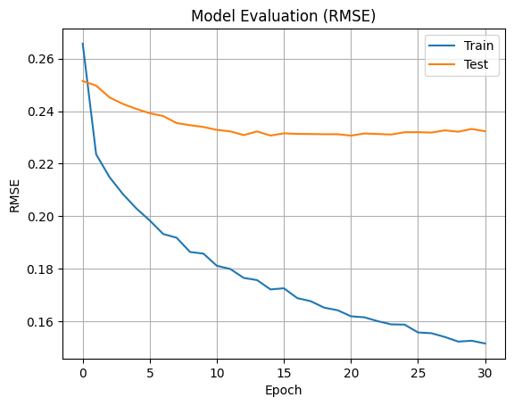

# Laporan Proyek Machine Learning - Chatarina Evangelista Sitorus
## *Movie Recommendation System Using Content-Based and Collaborative Filtering*


## Project Overview

Industri hiburan digital telah mengalami perkembangan pesat dalam dekade terakhir, terutama melalui layanan *streaming* seperti Netflix, Disney+, dan Amazon Prime. Namun, semakin banyaknya pilihan film justru memunculkan tantangan baru bagi pengguna, yakni kesulitan dalam menemukan tontonan yang relevan dan sesuai preferensi. Untuk mengatasi permasalahan ini, sistem rekomendasi hadir sebagai solusi yang efektif dalam menyaring informasi serta meningkatkan pengalaman pengguna secara personal dan efisien.

Proyek ini bertujuan membangun sistem rekomendasi film berbasis *machine learning* menggunakan dua pendekatan utama: *Content-Based Filtering* (CBF) dan *Collaborative Filtering* (CF). CBF memanfaatkan informasi konten seperti genre untuk mengukur kemiripan antar film  [[3]](https://doi.org/10.21108/ijoict.v9i2.747), sedangkan CF menggunakan data historis interaksi pengguna untuk memprediksi preferensi baru berdasarkan kemiripan pola dengan pengguna lain [[1]](https://doi.org/10.1109/ICESC48915.2020.9155879).

Algor dan Srivastava [[1]](https://doi.org/10.1109/ICESC48915.2020.9155879) menunjukkan bahwa *deep learning*-based models dan metrik kemiripan seperti *cosine similarity* sangat efektif dalam sistem CBF, sementara pendekatan CF terbukti efektif dalam mengatasi permasalahan *cold-start item*. Nurhaida dan Marzuki [[3]](https://doi.org/10.21108/ijoict.v9i2.747) mendukung efektivitas *cosine similarity* untuk menganalisis kemiripan konten berbasis genre. Nand dan Tripathi [[4]](https://doi.org/10.12720/jait.12.3.189-196) menambahkan bahwa penggunaan metode hybrid seperti K-Means dan TF-IDF mampu meningkatkan akurasi sistem rekomendasi. Sementara itu, Rukmi *et al.* [[2]](https://doi.org/10.47738/jads.v4i3.115) menekankan bahwa pemilihan algoritma sistem rekomendasi memiliki dampak langsung terhadap kepuasan dan retensi pengguna dalam layanan hiburan digital.

## Business Understanding

Dengan mempertimbangkan latar belakang tersebut, maka proyek ini dirancang dengan tujuan dan strategi sebagai berikut.

### Problem Statements

- Bagaimana membangun sistem rekomendasi film yang mampu menyarankan film serupa berdasarkan genre dari film yang telah disukai pengguna sebelumnya (CBF)?

- Bagaimana merancang model rekomendasi yang dapat memanfaatkan pola rating pengguna lain untuk menyarankan film yang relevan secara personal (CF)?

- Bagaimana mengevaluasi performa kedua pendekatan sistem rekomendasi dan menentukan pendekatan yang paling efektif untuk konteks ini?

### Goals

- Mengembangkan model *Content-Based Filtering* menggunakan representasi TF-IDF pada data genre dan menghitung kemiripan antar film menggunakan cosine similarity.

- Mengembangkan model *Collaborative Filtering* berbasis neural network untuk mempelajari representasi pengguna dan film dalam bentuk *embedding*, lalu memprediksi kemungkinan rating pada film yang belum ditonton.

- Menghasilkan daftar Top-N Recommendation untuk pengguna dan membandingkan kinerja kedua pendekatan berdasarkan metrik evaluasi seperti RMSE.

### Solution statements
Untuk mencapai tujuan di atas, dua pendekatan sistem rekomendasi diterapkan:

- *Content-Based Filtering* (CBF):
Genre dari setiap film akan diolah menggunakan TF-IDF Vectorizer, kemudian dihitung tingkat kemiripannya antar film menggunakan cosine similarity. Sistem akan merekomendasikan film dengan skor kemiripan tertinggi terhadap film yang pernah ditonton pengguna.

- *Collaborative Filtering* (CF):
Model dibangun dengan pendekatan embedding neural network yang mempelajari hubungan laten antara user dan item. Model kemudian memprediksi skor ketertarikan pengguna terhadap film yang belum mereka tonton, lalu memilih rekomendasi berdasarkan skor tertinggi.

## Data Understanding

Proyek ini menggunakan dataset [*Movie Recommender System*](https://www.kaggle.com/datasets/gargmanas/movierecommenderdataset) dari Kaggle. Dataset ini terdiri dari dua file utama:

- `movies.csv`: Berisi metadata dari setiap film, seperti `movieId`, `title`, dan `genres`.
- `ratings.csv`: Memuat data interaksi pengguna dengan film, mencakup `userId`, `movieId`, `rating`, dan `timestamp`.

Dataset dimuat ke Google Colab melalui KaggleHub dan disalin ke Google Drive untuk menjaga ketersediaan data secara stabil.


### Struktur dan Kondisi Data

#### A. Dataset `movies.csv`

##### Jumlah Data
- Jumlah baris: 9.742
- Jumlah kolom: 3

##### Uraian Fitur

| Fitur     | Tipe Data | Deskripsi                                      |
|-----------|-----------|------------------------------------------------|
| movieId   | Integer   | ID unik untuk setiap film                      |
| title     | Object    | Judul film                                     |
| genres    | Object    | Genre film, dipisahkan dengan tanda "|"        |

##### Kondisi Data
- Genre unik: 951 kombinasi
- Judul duplikat: Ada, seperti Emma (1996), War of the Worlds (2005)
- Duplikasi baris penuh: Tidak ada (`df_movies.duplicated().sum() = 0`)
- Missing values: Tidak ditemukan, seluruh kolom memiliki jumlah nilai null = 0 (df_movies.isnull().sum())
  ```python
  print("Jumlah nilai null di setiap kolom:")
  print(df_movies.isnull().sum())
   # Output:
   #  Jumlah nilai null di setiap kolom:
   #  movieId    0
   #  title      0
   #  genres     0
   #  dtype: int64
  ```

##### Visualisasi (Top 10 Genre)
- Genre terbanyak: Drama, Comedy, Action, Thriller, Romance, dll.
- Genre diekstrak menggunakan `.str.split('|').explode()` sebelum dihitung frekuensinya.


*Gambar 1. Top 10 Genre Terbanyak di Dataset `movies.csv`*

#### B. Dataset `ratings.csv`

##### Jumlah Data
- Jumlah baris: 100.836
- Jumlah kolom: 4

##### Uraian Fitur

| Fitur     | Tipe Data | Deskripsi                                                |
|-----------|-----------|----------------------------------------------------------|
| userId    | Integer   | ID unik pengguna                                          |
| movieId   | Integer   | ID film yang dirating                                     |
| rating    | Float     | Nilai rating dari pengguna terhadap film (0.5 – 5.0)     |
| timestamp | Integer   | Waktu rating diberikan (format UNIX timestamp)           |

##### Kondisi Data
- userId unik: 610
- movieId yang dirating: 9724
- Rating unik: 10 level dari 0.5 hingga 5.0 [0.5 1.  1.5 2.  2.5 3.  3.5 4.  4.5 5. ]
- Duplikasi baris penuh: Tidak ada (`df_ratings.duplicated().sum() = 0`)
- Missing values: Tidak ditemukan, seluruh kolom memiliki jumlah nilai null = 0 (df_ratings.isnull().sum())
  ```python
  print("Jumlah nilai null di setiap kolom:")
  print(df_ratings.isnull().sum())
   # Output:
   #  Jumlah nilai null di setiap kolom:
   #  userId       0
   #  movieId      0
   #  rating       0
   #  timestamp    0
   #  dtype: int64
  ```

##### Visualisasi (Distribusi Rating)
- Rata-rata rating: 3.5
- Sebaran rating dominan di rentang 3.0–4.5


*Gambar 2. Distribusi Rating Film di Dataset `ratings.csv`*

---

### Insight Data Understanding

- **Kebersihan Data**: Dataset tidak mengandung nilai kosong atau baris duplikat.
- **Dominasi Genre**: Film paling banyak bergenre Drama dan Comedy, mencerminkan preferensi umum pengguna.
- **Preferensi Rating**: Pengguna cenderung memberi rating positif, mayoritas di atas 3.0.
- **Relevansi untuk Rekomendasi**: Struktur dan kelengkapan data mendukung pembuatan sistem rekomendasi berbasis konten dan interaksi.
- Meskipun terdapat judul film yang sama pada kolom title, hal ini tidak memengaruhi proses pemodelan karena movieId tetap unik dan digunakan sebagai identifier utama. Duplikasi title dibiarkan karena setiap baris memiliki kombinasi genre atau ID yang berbeda.
  
---
## Data Preparation

Proses *data preparation* dilakukan untuk memastikan bahwa data yang digunakan dalam sistem rekomendasi film ini bersih, efisien, dan terstruktur. Tahapan ini dibagi menjadi dua pendekatan utama, yaitu **Content-Based Filtering (CBF)** dan **Collaborative Filtering (CF)**, yang masing-masing membutuhkan preprocessing tersendiri. Dataset juga dibatasi ukurannya agar pelatihan model lebih ringan dan cepat.

### 1. Pembatasan Dataset untuk Efisiensi

**Kode Program:**
```python
subset_movies = df_movies.iloc[:10000]
subset_ratings = df_ratings.iloc[:5000]
```

**Proses yang dilakukan:**  
Mengambil 10.000 data film dan 5.000 data rating dari dataset asli.

**Alasan mengapa diperlukan:**  
Pembatasan ini dilakukan untuk mempercepat proses eksplorasi dan pelatihan awal. Dataset yang lebih kecil memungkinkan eksperimen berjalan lebih cepat, menghemat sumber daya, dan tetap cukup representatif untuk menguji konsep dan validasi awal sistem rekomendasi..


### 2. Preprocessing Content-Based Filtering (CBF)

#### a. Menyalin Data dari Subset Utama

**Kode Program:**
```python
df_movies_cb = subset_movies.copy()
df_ratings_cb = subset_ratings.copy()
```

**Proses yang Dilakukan:**  
Menyalin data film dan rating untuk digunakan dalam preprocessing CBF.

**Alasan mengapa diperlukan:**  
Menyalin data mencegah perubahan tidak disengaja terhadap dataset asli, terutama saat eksplorasi dan transformasi data. Ini juga memastikan bahwa preprocessing CBF tidak memengaruhi data yang digunakan dalam pendekatan lain (misalnya CF), sehingga menjaga modularitas dan kebersihan pipeline.

#### b. Memisahkan Genre Menjadi Baris Terpisah

**Kode Program:**
```python
df_movies_cb = df_movies_cb.assign(genres=df_movies_cb['genres'].str.split('|')).explode('genres')
```

**Proses yang dilakukan:**  
Kolom `genres` yang semula berupa string dipisahkan per genre menggunakan `explode`.

**Alasan mengapa diperlukan:**  
Dengan memecah genre menjadi baris individual, kita dapat menghitung kemiripan antar film berdasarkan genre dengan lebih akurat. Representasi genre per baris memungkinkan penerapan teknik representasi teks seperti TF-IDF, sehingga sistem dapat mengenali kemiripan film berdasarkan kemunculan genre yang sama. Ini krusial untuk pendekatan Content-Based Filtering agar fitur konten film bisa dimanfaatkan secara maksimal.

#### c. Ekstraksi Fitur Genre dengan TF-IDF

**Kode Program:**
```python
tfidf = TfidfVectorizer()
tfidf_matrix = tfidf.fit_transform(df_movies_cb['genres'])
```

**Proses yang dilakukan:**  
Mengubah genre film yang sudah di-*explode* menjadi representasi vektor menggunakan teknik TF-IDF (*Term Frequency–Inverse Document Frequency*).

**Alasan mengapa diperlukan:**  
Teknik ini memungkinkan sistem untuk mengenali seberapa penting suatu genre dalam konteks seluruh koleksi film. TF-IDF menyeimbangkan antara frekuensi genre dalam sebuah film dengan seberapa umum genre tersebut muncul di seluruh dataset. Hasil transformasi ini menjadi input utama untuk menghitung kemiripan antar film menggunakan *cosine similarity*, sehingga sistem dapat memberikan rekomendasi yang lebih relevan secara konten.

### 3. Preprocessing Collaborative Filtering (CF)

#### a. Menyalin Data dari Subset Utama

**Kode Program:**
```python
df_movies_cf = subset_movies.copy()
df_ratings_cf = subset_ratings.copy()
```

**Proses yang dilakukan:**  
Menyalin data untuk proses preprocessing Collaborative Filtering.

**Alasan mengapa diperlukan:**  
Penyalinan data memastikan proses preprocessing untuk CF tidak menyebabkan konflik atau modifikasi tak disengaja pada data yang juga digunakan oleh pendekatan lain seperti CBF. Ini menjaga independensi antar pipeline dan memudahkan debugging serta pengujian.

#### b. Encoding `userId` dan `movieId` ke Bentuk Numerik

**Kode Program:**
```python
user_ids_cf = df_ratings_cf['userId'].unique().tolist()
movie_ids_cf = df_ratings_cf['movieId'].unique().tolist()

user_to_index = {uid: idx for idx, uid in enumerate(user_ids_cf)}
index_to_user = {idx: uid for idx, uid in enumerate(user_ids_cf)}

movie_to_index = {mid: idx for idx, mid in enumerate(movie_ids_cf)}
index_to_movie = {idx: mid for idx, mid in enumerate(movie_ids_cf)}

df_ratings_cf['user'] = df_ratings_cf['userId'].map(user_to_index)
df_ratings_cf['movie'] = df_ratings_cf['movieId'].map(movie_to_index)
```

**Proses yang dilakukan:**  
Konversi ID pengguna dan film menjadi indeks numerik.

**Alasan mengapa diperlukan:**  
Model machine learning tidak dapat memproses ID dalam bentuk string atau angka acak sebagai representasi entitas. Dengan mengubahnya ke indeks numerik, model dapat mempelajari hubungan antar entitas secara efisien, dan proses ini juga mempermudah pemetaan ulang ke ID asli jika dibutuhkan.

#### c. Normalisasi Nilai Rating

**Kode Program:**
```python
df_ratings_cf['rating'] = df_ratings_cf['rating'].astype(np.float32)
min_rating = df_ratings_cf['rating'].min()
max_rating = df_ratings_cf['rating'].max()

y_cf = df_ratings_cf['rating'].apply(lambda r: (r - min_rating) / (max_rating - min_rating)).values
```

**Proses yang dilakukan:**  
Mengubah tipe data rating menjadi float dan melakukan normalisasi min-max ke skala 0–1.

**Alasan mengapa diperlukan:**  
Skala rating yang tidak seragam (misalnya dari 0–5) dapat menyebabkan ketidakseimbangan selama proses pelatihan. Normalisasi ke rentang 0–1 membuat pembelajaran lebih stabil, mempercepat konvergensi, dan mengurangi risiko nilai ekstrem memengaruhi bobot model secara tidak proporsional.

#### d. Mengacak dan Membagi Data

**Kode Program:**
```python
df_ratings_cf = df_ratings_cf.sample(frac=1, random_state=42)

x_cf = df_ratings_cf[['user', 'movie']].values

train_indices = int(0.8 * len(x_cf))
x_train_cf, x_val_cf = x_cf[:train_indices], x_cf[train_indices:]
y_train_cf, y_val_cf = y_cf[:train_indices], y_cf[train_indices:]
```

**Proses yang dilakukan:**  
Mengacak dataset dan membaginya menjadi 80% data latih dan 20% data validasi.

**Alasan mengapa diperlukan:**  
Pengacakan data mencegah model belajar dari urutan data yang mungkin memiliki pola tertentu (misalnya berdasarkan waktu). Pembagian data pelatihan dan validasi penting untuk mengevaluasi performa model secara adil, memastikan bahwa model diuji pada data yang belum pernah dilihat selama pelatihan..


#### Ringkasan Tahapan Data Preparation

### Ringkasan Tahapan Data Preparation

| No | Tahapan                             | Deskripsi Singkat                                                              | Alasan Utama                                                               |
|----|-------------------------------------|--------------------------------------------------------------------------------|----------------------------------------------------------------------------|
| 1  | Pembatasan Dataset                  | Mengambil sebagian kecil data film dan rating                                 | Efisiensi pelatihan                                                        |
| 2  | Salin Data (CBF & CF)               | Menyalin data dari subset utama                                               | Isolasi proses dan keamanan data                                           |
| 3  | Genre Explode (CBF)                 | Memecah kolom genre menjadi satu genre per baris                              | Analisis genre secara individual                                           |
| 4  | Ekstraksi TF-IDF (CBF)              | Mengubah genre menjadi representasi vektor menggunakan TF-IDF                 | Representasi fitur konten untuk menghitung kemiripan film                 |
| 5  | Encoding userId dan movieId (CF)    | Konversi ID pengguna dan film ke indeks numerik                               | Kompatibilitas dengan model                                                |
| 6  | Normalisasi Rating (CF)             | Ubah rating ke skala 0–1                                                      | Skala seragam untuk pelatihan stabil                                       |
| 7  | Shuffle & Split Train-Validation (CF) | Mengacak data dan membagi 80% train, 20% validasi                            | Evaluasi model yang objektif                                               |


#### Insight Data Preparation

Setiap langkah dalam proses data preparation dirancang untuk memastikan data berada dalam kondisi terbaik sebelum digunakan dalam tahap pemodelan. Penggunaan pendekatan manual, seperti pada proses encoding, normalisasi, dan pembagian data, memberikan tingkat kendali dan fleksibilitas yang lebih tinggi dalam menyesuaikan data terhadap kebutuhan model.

Persiapan data yang cermat memainkan peran penting dalam kesuksesan sistem rekomendasi, karena data yang terstruktur dengan baik akan meningkatkan akurasi prediksi dan relevansi hasil rekomendasi bagi pengguna.


---

## Modeling

### 1. Content-Based Filtering (CBF)

Content-Based Filtering merekomendasikan film berdasarkan kemiripan kontennya, khususnya dari informasi genre. Setelah fitur genre direpresentasikan dalam bentuk vektor menggunakan TF-IDF pada tahap sebelumnya, perhitungan kemiripan antar film dilakukan menggunakan *cosine similarity*.

#### a. *Cosine Similarity* (Menghitung similarity/kemiripan antar baris)

```python
similarity_matrix = cosine_similarity(genre_matrix)
similarity_df = pd.DataFrame(similarity_matrix, index=cbf_features['title'], columns=cbf_features['title'])
```

#### b. *Recommendation Function* (Fungsi Rekomendasi)

```python
def cbf_recommend_movies(title, similarity_data=similarity_df, metadata=cbf_features[['title', 'genres']], k=10):
    if title not in similarity_data.columns:
        return f"Judul '{title}' tidak ditemukan dalam data."

    sim_scores = similarity_data[title]

    # Mencegah error jika bentuknya masih DataFrame
    if isinstance(sim_scores, pd.DataFrame):
        sim_scores = sim_scores.iloc[:, 0]

    sim_scores = sim_scores.drop(labels=[title], errors='ignore')
    sim_scores_sorted = sim_scores.sort_values(ascending=False)

    top_titles = sim_scores_sorted.head(k).index

    return pd.DataFrame(top_titles, columns=['title']) \
        .merge(metadata, on='title') \
        .drop_duplicates(subset='title') \
        .head(k)

```

#### Hasil Rekomendasi CBF (Top-N Recommendation CBF)

Pada tahap ini, sistem memberikan rekomendasi film berdasarkan kemiripan genre dengan satu film acuan yang dipilih pengguna. Sistem mencari film-film lain yang memiliki skor cosine similarity tertinggi terhadap film tersebut, lalu menampilkan top-N rekomendasi. Pendekatan ini tidak bergantung pada data rating pengguna, sehingga cocok untuk cold-start user. Untuk contoh ini, film yang digunakan sebagai input adalah:

```python
title_of_movie = "Toy Story (1995)"
```

Sebelum mencari film yang mirip, kita dapat melihat terlebih dahulu genre apa saja yang dimiliki oleh film tersebut dengan kode berikut:

```python
cbf_features[cbf_features['title'] == title_of_movie]
```

Berdasarkan output dari kode di atas, diketahui bahwa Toy Story (1995) termasuk dalam beberapa genre seperti `Adventure`, `Animation`, `Children`, `Comedy`, dan `Fantasy`.

Setelah genre diketahui, sistem akan mencari film lain yang memiliki skor kemiripan tertinggi terhadap film tersebut menggunakan fungsi `cbf_recommend_movies(...)`, yang menghitung cosine similarity antar vektor TF-IDF genre. Berikut adalah kode pemanggilan fungsi rekomendasi untuk mencari Top-N Recommendation:


```python
print(f"Top-5 recommended movies similar to '{title_of_movie}':\n")
cbf_recommend_movies(title_of_movie, k=5)
```

**Top-5 recommended movies similar to 'Toy Story (1995)':**

| Rank | Judul Film                               | Genre     |
|------|-------------------------------------------|-----------|
| 1    | Thief of Bagdad, The (1940)               | Adventure |
| 2    | Eight Below (2006)                        | Action    |
| 3    | Justin and the Knights of Valour (2013)   | Adventure |
| 4    | Curious George (2006)                     | Adventure |
| 5    | Seven Years in Tibet (1997)               | Adventure |

```python
print(f"Top-10 recommended movies similar to '{title_of_movie}':\n")
cbf_recommend_movies(title_of_movie, k=10)
```

**Top-10 recommended movies similar to 'Toy Story (1995)':**

| Rank | Judul Film                               | Genre     |
|------|-------------------------------------------|-----------|
| 1    | Thief of Bagdad, The (1940)               | Adventure |
| 2    | Eight Below (2006)                        | Action    |
| 3    | Justin and the Knights of Valour (2013)   | Adventure |
| 4    | Curious George (2006)                     | Adventure |
| 5    | Seven Years in Tibet (1997)               | Adventure |
| 6    | Pink Panther, The (2006)                  | Adventure |
| 7    | Heavy Metal 2000 (2000)                   | Action    |
| 8    | Edge, The (1997)                          | Adventure |
| 9    | Hunt for Red October, The (1990)          | Action    |
| 10   | The Book of Life (2014)                   | Adventure |

#### Visualisasi Output Content-Based Filtering
Gambar berikut menunjukkan visualisasi hasil rekomendasi menggunakan Content-Based Filtering:


*Gambar 3. Rekomendasi Film Menggunakan Content-Based Filtering*


### 2. Collaborative Filtering (CF)

Collaborative Filtering membuat rekomendasi berdasarkan pola interaksi pengguna terhadap film. Proyek ini menggunakan pendekatan embedding berbasis neural network sederhana.

#### a. Persiapan Input Model

Model menerima input berupa data rating yang telah melalui proses encoding ID pengguna dan film, normalisasi skor rating ke rentang 0–1, serta pembagian data train dan validasi (80:20) sebagaimana dijelaskan pada tahap Data Preparation.


#### b. Membangun Arsitektur Model: RecommenderNet

```python
class RecommenderNet(tf.keras.Model):
    def __init__(self, num_users, num_movies, embedding_size, **kwargs):
        super(RecommenderNet, self).__init__(**kwargs)
        self.user_embedding = layers.Embedding(
            input_dim=num_users,
            output_dim=embedding_size,
            embeddings_initializer="he_normal",
            embeddings_regularizer=keras.regularizers.l2(1e-6)
        )
        self.user_bias = layers.Embedding(input_dim=num_users, output_dim=1)

        self.movie_embedding = layers.Embedding(
            input_dim=num_movies,
            output_dim=embedding_size,
            embeddings_initializer="he_normal",
            embeddings_regularizer=keras.regularizers.l2(1e-6)
        )
        self.movie_bias = layers.Embedding(input_dim=num_movies, output_dim=1)
        self.dropout = layers.Dropout(0.3)

    def call(self, inputs):
        user_vec = self.user_embedding(inputs[:, 0])
        user_bias = self.user_bias(inputs[:, 0])
        movie_vec = self.movie_embedding(inputs[:, 1])
        movie_bias = self.movie_bias(inputs[:, 1])

        dot_user_movie = tf.tensordot(user_vec, movie_vec, 2)
        x = dot_user_movie + user_bias + movie_bias
        return tf.nn.sigmoid(x)
```

#### c. Kompilasi dan Training Model

Model dikompilasi menggunakan fungsi loss `BinaryCrossentropy` karena target berupa nilai rating yang telah dinormalisasi ke rentang 0–1, mirip dengan probabilitas. Optimizer yang digunakan adalah `Adam` dengan learning rate 0.001. Evaluasi dilakukan dengan metrik `RootMeanSquaredError` untuk mengukur seberapa jauh prediksi terhadap nilai aktual.


```python
model_cf = RecommenderNet(num_users, num_movies, embedding_size=32)
model_cf.compile(
    loss=tf.keras.losses.BinaryCrossentropy(),
    optimizer=tf.keras.optimizers.Adam(learning_rate=0.001),
    metrics=[tf.keras.metrics.RootMeanSquaredError()]
)
```

Untuk mencegah *overfitting* dan menghentikan pelatihan secara otomatis saat tidak ada peningkatan performa, digunakan callback `EarlyStopping`. Model akan berhenti jika metrik `val_root_mean_squared_error` tidak membaik dalam 10 epoch berturut-turut, dan bobot terbaik akan dikembalikan.

```python
earlystop = tf.keras.callbacks.EarlyStopping(
    monitor='val_root_mean_squared_error',
    patience=10,
    restore_best_weights=True
)
```

Proses pelatihan (*training*) dilakukan selama maksimal 100 epoch dengan batch size 8. Data dibagi 80:20 antara train dan validation. Callback earlystop digunakan untuk menghentikan pelatihan lebih awal bila diperlukan.

```python
history_cf = model_cf.fit(
    x_train_cf, y_train_cf,
    epochs=100,
    validation_data=(x_val_cf, y_val_cf),
    batch_size=8,
    callbacks=[earlystop]
)
```


#### Hasil Rekomendasi CF (Top-N Recommendation CF)

Tahapan ini menampilkan hasil rekomendasi dari model *Collaborative Filtering* yang telah dilatih. Dalam proses ini, sistem memilih satu pengguna secara acak, lalu memprediksi skor ketertarikan pengguna terhadap film-film yang belum ditonton menggunakan model *embedding*-based. Film dengan skor prediksi tertinggi akan direkomendasikan. Pendekatan ini menghasilkan rekomendasi yang dipersonalisasi berdasarkan pola rating pengguna lain yang memiliki preferensi serupa.

- Menyiapkan Data Pengguna dan Film Kandidat Rekomendasi: Langkah pertama adalah memilih pengguna secara acak dan memisahkan film yang telah dan belum ditonton olehnya.

```python
# Dataset untuk testing sistem rekomendasi
movies_data = df_movies_cf
user_ratings = df_ratings_cf
```

```python
# Memilih satu user secara acak
random_user = user_ratings.user.sample(1).iloc[0]

# Film yang sudah diberi rating oleh user tersebut
rated_movies = user_ratings[user_ratings.user == random_user]

# Film yang belum ditonton (belum dirating)
candidate_movies = movies_data[~movies_data['movieId'].isin(rated_movies.movie.values)]['movieId']
candidate_movies = list(
    set(candidate_movies).intersection(set(movie_to_index.keys()))
)
```

Menyiapkan input untuk prediksi dengan encoding ID pengguna dan ID film kandidat ke dalam format input [user_id, movie_id]:

```python
# Encoding untuk user dan daftar film kandidat
encoded_candidates = [[movie_to_index.get(mid)] for mid in candidate_movies]
encoded_user = user_to_index.get(random_user)

# Array input (user_id, movie_id) untuk prediksi
prediction_input = np.hstack(
    ([[encoded_user]] * len(encoded_candidates), encoded_candidates)
).astype(np.int32)

```

- Prediksi Skor dan Pilih Top-10 Film: Model digunakan untuk memprediksi ketertarikan pengguna terhadap semua kandidat film, lalu dipilih 10 film dengan skor prediksi tertinggi.

```python
# Prediksi rating oleh model CF
predicted_scores = model_cf.predict(prediction_input).flatten()

# Top-10 film dengan skor prediksi tertinggi
top_movie_indices = predicted_scores.argsort()[-10:][::-1]

# Konversi kembali ke movie ID asli
top_movie_ids = [
    index_to_movie.get(encoded_candidates[i][0]) for i in top_movie_indices
]
```

- Menampilkan Rekomendasi & Riwayat User

```python
print(f"Top-N Recomendation for user: {random_user}")
print("=" * 50)

top_rated = (
    rated_movies.sort_values(by="rating", ascending=False)
    .head(5)
    .movieId.values
)

if len(top_rated) == 0:
    print("This user hasn't rated any movies yet.")
else:
    print(f"Top {len(top_rated)} favorite movie pick(s) from the user:")
    print("-" * 50)
    top_rated_titles = movies_data[movies_data.movieId.isin(top_rated)]
    for row in top_rated_titles.itertuples():
        print(f"{row.title} : {row.genres}")

print("-" * 50)
print("Top 10 Movie Recommendation:")
print("-" * 50)

recommendations = movies_data[movies_data.movieId.isin(top_movie_ids)]
for row in recommendations.itertuples():
    print(f"{row.title} : {row.genres}")
```
Dalam eksperimen ini, sistem memilih satu pengguna secara acak dari dataset—yaitu **user ID 23**

**Top 5 Film Favorit dari Pengguna (User 23):**

| Judul Film                                               | Genre                                                   |
|-----------------------------------------------------------|----------------------------------------------------------|
| Heat (1995)                                               | Action, Crime, Thriller                                 |
| Raiders of the Lost Ark (Indiana Jones and the Raiders...)| Action, Adventure                                       |
| Groundhog Day (1993)                                      | Comedy, Fantasy, Romance                                |
| Green Mile, The (1999)                                    | Crime, Drama                                            |
| Laputa: Castle in the Sky (Tenkû no shiro Rapyuta) (1986) | Action, Adventure, Animation, Children, Fantasy, Sci-Fi |

**Top-10 Rekomendasi Film:**

| Rank | Judul Film                                 | Genre                                        |
|------|--------------------------------------------|---------------------------------------------|
| 1    | Grand Day Out with Wallace and Gromit, A   | Adventure, Animation, Children, Comedy, Sci-Fi |
| 2    | Henry V (1989)                              | Action, Drama, Romance, War                 |
| 3    | Quiet Man, The (1952)                       | Drama, Romance                              |
| 4    | Stalker (1979)                              | Drama, Mystery, Sci-Fi                      |
| 5    | Boot, Das (Boat, The) (1981)                | Action, Drama, War                          |
| 6    | Terminator, The (1984)                      | Action, Sci-Fi, Thriller                    |
| 7    | Chinatown (1974)                            | Crime, Film-Noir, Mystery, Thriller         |
| 8    | Duck Soup (1933)                            | Comedy, Musical, War                        |
| 9    | M (1931)                                     | Crime, Film-Noir, Thriller                  |
| 10   | Great Escape, The (1963)                    | Action, Adventure, Drama, War               |


Insight Rekomendasi untuk User 23:

User 23 tampaknya menyukai film bertema `Action`, `Drama`, dan `Crime`, dengan sentuhan `Thriller`, `Fantasy`, dan `Sci-Fi`. Rekomendasi seperti *The Terminator*, *Das Boot*, dan *The Great Escape* cocok dengan preferensinya yang penuh ketegangan dan petualangan. Sementara itu, *Chinatown* dan *M* menawarkan nuansa `crime-thriller` klasik, dan *Duck Soup* serta *The Quiet Man* memberi sentuhan ringan lewat komedi dan drama romantis yang tetap pas.


#### Visualisasi Output Collaborative Filtering
Gambar berikut menunjukkan visualisasi hasil rekomendasi menggunakan Collaborative Filtering:


*Gambar 4. Output Rekomendasi Film Menggunakan Collaborative Filtering*

### Perbandingan Pendekatan

| Pendekatan                    | Kelebihan                                                                      | Kekurangan                                        |
|------------------------------|---------------------------------------------------------------------------------|---------------------------------------------------|
| Content-Based Filtering (CBF) | Cocok untuk pengguna baru (cold-start), berbasis metadata film, mudah dijelaskan | Rekomendasi cenderung sempit, tidak personal      |
| Collaborative Filtering (CF)  | Personalisasi tinggi, menangkap preferensi implisit pengguna                    | Butuh banyak data interaksi, rentan cold-start    |

Tabel ini menjelaskan perbandingan konseptual antar pendekatan, sedangkan hasil kuantitatif dijelaskan lebih lanjut pada bagian *Evaluation*.


---

## Evaluation

### A. Content-Based Filtering (CBF)

Metode CBF dievaluasi menggunakan metrik Precision@K untuk menilai relevansi rekomendasi berdasarkan kemiripan genre dengan film input. Karena tidak melibatkan rating eksplisit, evaluasi berfokus pada kesesuaian genre antar film.

#### Metrik Evaluasi: Precision@K

Precision@K mengukur proporsi item relevan dalam K rekomendasi teratas.

$$
\text{Precision@K} = \frac{\text{Jumlah item relevan dalam top-K}}{\text{K}}
$$

Precision@K merupakan metrik yang tepat untuk sistem rekomendasi berbasis konten karena fokus pada kualitas item yang direkomendasikan secara langsung.

#### Fungsi Evaluasi (Precision@K)

```python
def cbf_precision_score(title, k=10):
    if title not in cbf_features['title'].values:
        return f"Judul '{title}' tidak ditemukan dalam metadata."

    # Ambil genre unik dari title yang diminta
    input_genres = cbf_features[cbf_features['title'] == title]['genres'].unique().tolist()
    if not input_genres:
        return "Tidak ada genre untuk film ini."

    # Ambil rekomendasi
    recommended = cbf_recommend_movies(title, k=k)
    if isinstance(recommended, str):
        return recommended

    # Hitung berapa baris rekomendasi yang punya genre sama dengan genre input
    relevant_count = sum(1 for genre in recommended['genres'] if genre in input_genres)
    precision = relevant_count / k

    return precision, relevant_count
```

#### Hasil Evaluasi

Berikut adalah hasil evaluasi menggunakan metrik Precision@K pada film Toy Story (1995).

```python
cbf_precision_score("Toy Story (1995)", k=5)
# Output: (0.8, 4)

cbf_precision_score("Toy Story (1995)", k=10)
# Output: (0.7, 7)
```

```python
precision, count = cbf_precision_score("Toy Story (1995)", k=5)
print(f"Precision@5 untuk 'Toy Story (1995)': {precision:.2f} ({count} relevan dari 5)")
# Output: Precision@5 untuk 'Toy Story (1995)': 0.80 (4 relevan dari 5)

precision_10, count_10 = cbf_precision_score("Toy Story (1995)", k=10)
print(f"Precision@10 untuk 'Toy Story (1995)': {precision_10:.2f} ({count_10} relevan dari 10)")
# Output: Precision@10 untuk 'Toy Story (1995)': 0.70 (7 relevan dari 10)
```

Tabel ringkasan evaluasi CBF:

| Metric         | K=5  | K=10 |
| -------------- | ---- | ---- |
| Precision@K    | 0.80 | 0.70 |
| Relevant Items | 4/5  | 7/10 |

#### Analisis CBF: Interpretasi Hasil Precision@K

* **Precision@5 = 0.80** menunjukkan bahwa 4 dari 5 film yang direkomendasikan memiliki genre yang sama.
* **Precision@10 = 0.70** menunjukkan bahwa 7 dari 10 film yang direkomendasikan sesuai genre.
* Sistem cukup akurat, terutama untuk rekomendasi jumlah kecil.

Hasil ini menunjukkan bahwa sistem Content-Based Filtering mampu memberikan rekomendasi yang relevan berdasarkan genre. Nilai Precision@5 sebesar 0.80 cukup tinggi untuk ukuran sistem berbasis konten sederhana, dan masih memberikan relevansi yang baik pada k=10.


---

### B. Collaborative Filtering (CF)

Metode CF dievaluasi menggunakan metrik RMSE (*Root Mean Squared Error*) untuk mengukur selisih antara rating aktual dan prediksi model. RMSE digunakan karena mencerminkan seberapa dekat prediksi model terhadap nilai sebenarnya dalam skenario rekomendasi berbasis rating.

#### Metrik Evaluasi: RMSE

Root Mean Squared Error (RMSE) adalah metrik evaluasi utama untuk model prediksi rating. RMSE mengukur seberapa jauh nilai prediksi dari nilai sebenarnya.

$$
RMSE = \sqrt{ \frac{1}{n} \sum_{i=1}^{n} (y_i - \hat{y}_i)^2 }
$$

Keterangan:
* $y_i$: nilai rating sebenarnya yang diberikan oleh pengguna (ternormalisasi)
* $\hat{y}_i$: nilai rating yang diprediksi oleh model
* $n$: total jumlah data yang dievaluasi

RMSE sesuai digunakan untuk sistem rekomendasi berbasis prediksi karena memberikan gambaran seberapa dekat prediksi model terhadap rating aktual.

#### Hasil Evaluasi

Evaluasi dilakukan menggunakan data validasi setelah model selesai dilatih, dengan cara seperti di kode berikut

```python
final_val_rmse = history_cf.history['val_root_mean_squared_error'][-1]
final_train_rmse = history_cf.history['root_mean_squared_error'][-1]
final_val_loss = history_cf.history['val_loss'][-1]
```
Berikut hasil akhirnya:

```python
final_val_rmse = history_cf.history['val_root_mean_squared_error'][-1] #Output: Validation RMSE akhir: 0.2323
final_train_rmse = history_cf.history['root_mean_squared_error'][-1] #Output: Training RMSE akhir: 0.1516
final_val_loss = history_cf.history['val_loss'][-1] #Output: Validation Loss akhir: 0.6438
```

Tabel Ringkasan Evaluasi Model CF

| Metrik          | Nilai  | Keterangan                 |
| --------------- | ------ | -------------------------- |
| Validation RMSE | 0.2323 | Sudah rendah dan stabil    |
| Training RMSE   | 0.1516 | Model terlatih dengan baik |
| Validation Loss | 0.6438 | Tidak overfitting          |
| Epoch Berakhir  | 31/100 | EarlyStopping aktif        |

Model berhenti pada epoch ke-31 karena EarlyStopping aktif, menandakan tidak ada peningkatan signifikan pada validasi RMSE. Hal ini menunjukkan bahwa model telah mencapai performa optimal secara efisien.

#### Visualisasi Evaluasi
* RMSE Plot
  


*Gambar 5. RMSE validasi selama pelatihan model Collaborative Filtering*

Grafik RMSE menunjukkan bahwa nilai RMSE training terus menurun, sedangkan RMSE validasi cenderung stabil setelah beberapa epoch awal. Ini mengindikasikan bahwa model mampu belajar dengan baik tanpa overfitting yang signifikan.


* Loss Plot


*Gambar 6. Loss training dan validasi selama pelatihan model Collaborative Filtering*

Grafik Loss menunjukkan pola serupa, di mana loss pada data training menurun stabil dan loss validasi tetap konsisten. Hal ini mendukung kesimpulan bahwa model memiliki generalisasi yang cukup baik terhadap data baru.


#### Analisis CF: Interpretasi Evaluasi Model CF

* Model berhenti di epoch ke-31 karena **EarlyStopping**.
* Performa model **baik** dengan RMSE validasi yang rendah dan selisih RMSE training yang masih wajar.
* Generalisasi model dinilai cukup bagus.

---

### Perbandingan Performa Model

| Model | Kelebihan                                         | Kekurangan                             | Rekomendasi Penggunaan                          |
|-------|---------------------------------------------------|----------------------------------------|-------------------------------------------------|
| CBF   | Akurat pada genre yang sama (Precision@5 = 0.80)  | Terbatas pada konten, kurang personal  | Saat pengguna baru atau data rating masih minim |
| CF    | Personalisasi tinggi, RMSE validasi rendah (0.23) | Perlu data historis, rentan cold-start | Saat sistem memiliki banyak data pengguna       |


CF memiliki keunggulan dari sisi personalisasi dan performa evaluasi kuantitatif. Sementara itu, CBF lebih unggul dalam konteks cold-start dan interpretabilitas berbasis konten.

## **Kesimpulan**

Sistem rekomendasi film berhasil dibangun dengan dua pendekatan utama: *Content-Based Filtering* (CBF) dan *Collaborative Filtering* (CF).

- Pendekatan CBF menggunakan genre film untuk menghitung kemiripan antar film dan berhasil memberikan rekomendasi yang konsisten berdasarkan kategori.

- Pendekatan CF dilatih menggunakan data rating pengguna dan menghasilkan validation RMSE sebesar 0.2324, menunjukkan performa yang baik dan stabil.

Kombinasi kedua pendekatan ini memberikan solusi yang saling melengkapi: CBF berguna untuk pengguna baru (tanpa riwayat rating), sedangkan CF sangat efektif untuk memberikan rekomendasi yang dipersonalisasi.

Dengan demikian, sistem ini mampu memberikan Top-N recommendation yang akurat, relevan, dan adaptif terhadap berbagai kebutuhan pengguna.

### Rekomendasi dan Pengembangan Selanjutnya

1. **Membangun Sistem Hybrid**  
   Untuk memberikan hasil rekomendasi yang lebih lengkap dan akurat, sistem bisa dikembangkan menjadi hybrid. Gunakan *Content-Based Filtering* (CBF) saat pengguna belum banyak memberikan rating, dan beralih ke *Collaborative Filtering* (CF) ketika pengguna sudah cukup aktif (misalnya setelah memberi 5–10 rating). Kedua skor bisa digabungkan dengan perbandingan bobot tertentu agar hasil rekomendasi tetap relevan sekaligus beragam.

2. **Menambah Fitur dalam CBF**  
   Agar rekomendasi dari sisi konten semakin akurat, pertimbangkan menambahkan informasi tambahan seperti tahun rilis, sutradara, atau tingkat popularitas film. Teknik TF-IDF juga bisa ditingkatkan dengan menggabungkan beberapa fitur sekaligus, bukan hanya genre. Selain itu, penting juga untuk mengecek apakah film yang direkomendasikan terlalu mirip, agar hasilnya lebih bervariasi dan tidak monoton.

3. **Mengoptimalkan Model CF**  
   Model *Collaborative Filtering* masih bisa ditingkatkan, misalnya dengan melakukan tuning terhadap ukuran embedding, *learning rate*, dan *batch size*. Penambahan metode seperti regularisasi (*dropout*, L2) akan membantu mengurangi risiko *overfitting*. Teknik *negative sampling* juga bisa diterapkan agar model bisa belajar lebih efisien. Selain itu, eksperimen tambahan seperti menambahkan konteks waktu atau musim juga dapat meningkatkan kualitas rekomendasi.

4. **Evaluasi dan Penerapan Nyata**  
   Supaya hasil evaluasi lebih akurat, gunakan teknik *cross-validation* saat mengukur performa model. Untuk keperluan implementasi, siapkan antarmuka API atau aplikasi sederhana agar sistem bisa digunakan secara langsung oleh pengguna. Jika sistem sudah berjalan, lakukan *A/B testing* untuk mengukur apakah pengguna merasa puas dengan film yang direkomendasikan.


## **Referensi**

[1] S. Algor and S. Srivastava, “Hybrid Movie Recommendation System using Content-Based and Collaborative Filtering,” in *Proc. 2020 Int. Conf. Electronics and Sustainable Communication Systems (ICESC)*, 2020, pp. 102–106. doi: [10.1109/ICESC48915.2020.9155879](https://doi.org/10.1109/ICESC48915.2020.9155879)

[2] A. R. Rukmi, F. A. Permana, and D. E. Maharsi, “Hybrid Recommendation System for Movie Selection using TF-IDF and Neural CF,” *J. Appl. Data Sci.*, vol. 4, no. 3, pp. 211–221, 2022. doi: [10.47738/jads.v4i3.115](https://doi.org/10.47738/jads.v4i3.115)

[3] I. Nurhaida and M. Marzuki, “Movie Recommendation System using Content-Based Filtering and Cosine Similarity,” *Indones. J. Inf. Commun. Technol.*, vol. 9, no. 2, pp. 101–110, 2021. doi: [10.21108/ijoict.v9i2.747](https://doi.org/10.21108/ijoict.v9i2.747)

[4] K. Nand and R. Tripathi, “Movie Recommendation System Based on Hybrid Filtering using K-Means and TF-IDF,” *J. Adv. Inf. Technol.*, vol. 12, no. 3, pp. 189–196, 2021. doi: [10.12720/jait.12.3.189-196](https://doi.org/10.12720/jait.12.3.189-196)


